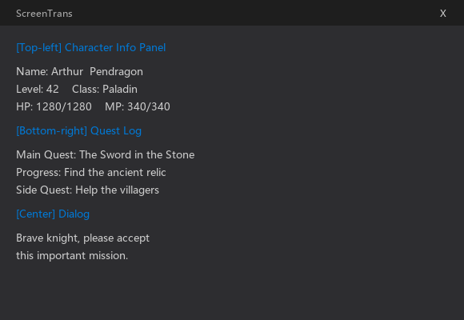
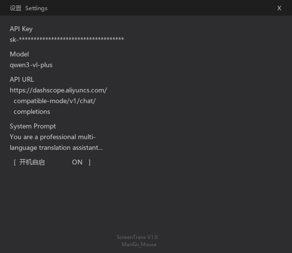

<p align="center">
  
</p>

<h1 align="center">ScreenTrans</h1>

<p align="center">Windows 屏幕截图翻译工具，基于 Qwen3-VL-Plus 视觉大模型。</p>

<p align="center">
  
  
  
</p>

---

## 截图

<p align="center">
  <br>
  <em>半透明翻译悬浮窗 — F8 切换显示/隐藏</em>
</p>

<p align="center">
  <br>
  <em>设置面板 — Ctrl+F8 打开</em>
</p>

## 功能

- **一键截图翻译** — F9 截取全屏，通过 Qwen3-VL-Plus 视觉模型识别图中文字并翻译为中文
- **半透明悬浮窗** — 翻译结果显示在置顶半透明窗口中，不影响游戏或全屏应用
- **游戏兼容** — 基于 `GetAsyncKeyState` 的独立轮询线程，绕过 DirectInput 游戏输入捕获
- **强制置顶** — Win32 `HWND_TOPMOST` + 周期性重断言，覆盖 DirectX 全屏游戏
- **可滚动文本** — Q/E 键上下滚动翻译结果
- **任务取消** — F7 取消正在进行的翻译请求
- **设置面板** — Ctrl+F8 打开，配置 API Key、模型、提示词、开机自启
- **开机自启** — 注册表 Run 键，药丸拨动开关控制
- **系统托盘** — 最小化到托盘，支持显示/退出操作

## 安装

下载 [ScreenTrans_Setup.exe](../../releases/latest) 并双击运行。标准安装向导：

1. 选择安装目录
2. 可选创建桌面快捷方式
3. 完成安装后自动启动

通过 Windows "设置 → 应用" 卸载。

## 使用方法

| 快捷键 | 功能 |
|--------|------|
| `F9` | 截取全屏并翻译 |
| `F8` | 显示/隐藏翻译悬浮窗 |
| `F7` | 取消正在进行的翻译 |
| `Ctrl+F8` | 打开设置面板 |
| `Q` | 向上滚动悬浮窗文本 |
| `E` | 向下滚动悬浮窗文本 |
| `Esc` | 关闭悬浮窗 / 关闭设置面板 |

### 配置 API Key

1. 访问 [DashScope](https://dashscope.aliyun.com/) 获取 API Key
2. 按 `Ctrl+F8` 打开设置面板
3. 填入 API Key、模型名称（默认 `qwen3-vl-plus`）
4. 点击保存，立即生效

### 翻译格式

模型返回的翻译文本按 `[方位]:` 格式分段，例如：

```
[左上角]: 角色信息面板
[中间]: 主菜单选项列表
[右下角]: 系统时间和通知
```

系统提示词可在设置中自定义，以调整翻译风格和输出格式。

## 从源码运行

```bash
git clone https://github.com/acangcang-Eliauk/ScreenTranslator.git
cd ScreenTranslator
pip install -r requirements.txt
python main.py
```

**依赖**: `mss`, `Pillow`, `requests`, `pystray`

## 打包

```bash
pip install pyinstaller
pyinstaller --onefile --windowed --name ScreenTrans --icon=icon.ico main.py
# dist/ScreenTrans.exe

# 构建安装包（需安装 Inno Setup 6）
iscc setup.iss
# 产出 ScreenTrans_Setup.exe
```

## 项目结构

```
ScreenTranslator/
├── main.py              # 应用主程序
├── setup.iss            # Inno Setup 安装脚本
├── icon.ico             # 应用图标
├── requirements.txt     # Python 依赖
├── design_report.md     # 设计报告（中文）
└── docs/
    ├── overlay.png      # 悬浮窗截图
    └── settings.png     # 设置面板截图
```

## 设计文档

详细设计报告见 [design_report.md](design_report.md)，包含架构、模块设计、API 集成、热键系统、数据流等 15 个章节。

## License

MIT
